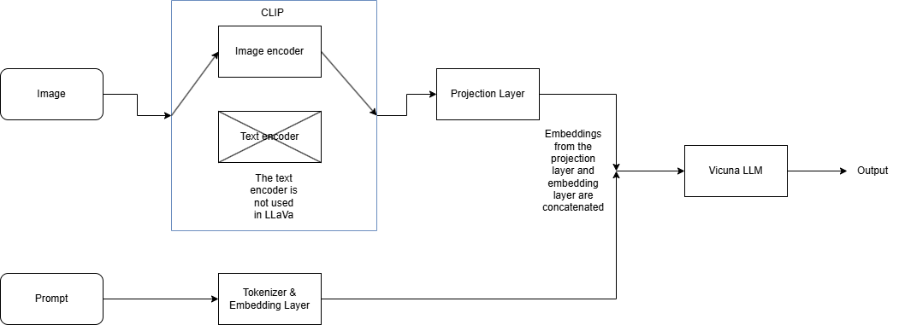

# Part 1 — Architecture Understanding

## Task 1.1: Forward Pass

LLaVA consists of multiple parts: the vision encoder, projection layer, and language model. There are some differences between LLaVA in the original paper and LLaVA 1.5/HD, which will be pointed out.

### Input

In the original LLaVA, the images should be of resolution 224 X 224 for the vision encoder. In LLaVA 1.5, it was increased to allow images of resolution 336 x 336. At the time, the highest resolution the vision encoder could support was 336 x 336. One way they got around this was to first partition the image into parts, feed those parts to the vision encoder independently. The output feature maps are stitched back together based on their relative position on the image and finally flattened. An important part is to include the necessary global context since each feature map doesn't "know" about the others. To do this, the image is downsampled to a lower resolution, fed to the vision encoder, and finally the output is concatenated with the rest of the feature maps.

### Vision Encoder

The vision encoder used for the original LLaVA is [CLIP ViT-L/14](https://huggingface.co/openai/clip-vit-large-patch14). This was later swapped to CLIP ViT-L-336px in version 1.5 to support resolutions up to 336 x 336. The vision encoder is frozen during training.

CLIP is a contrastive learning model. During pretraining, it takes in image-text pairs as inputs. The text is typically a description or a caption of the image. CLIP contains ViT and a transformer. Every image and text is fed into ViT and transformer, respectively, generating embeddings for both. It's important to note that both embeddings are in the same embedding space. This allows the model to compare the embeddings of the images and text using cosine similarity. The model learns by maximizing the cosine similarity of true pairs embeddings while minimizing the cosine similarity of negative pairs.

### Projection Layer

In order for the language model to process the visual features of the image, the visual features need to be projected to the same embeddings space as the word embeddings. In version 1, a linear layer projects the features from CLIP to the same embedding space as the word embedding. In version 1.5, an MLP is used. These embeddings are concatenated and fed to the language model.

### Language Model Input & Text Generation

The language model takes the projected image embeddings from the projection layer and the embeddings from the word embedding layer. In LLaVA, it's Vicuna, a LLaMa fine-tune on conversation data. As mentioned in the projection layer, the image feature embeddings are concatenated with the word embeddings and passed to the Vicuna. Vicuna's self-attention mechanism works across these embeddings and ultimately generates text output.

## Task 1.2: Projection Layer Intuition

As mentioned, the vision features from CLIP may be in a different embedding space than the language model allows. In order to match the required dimension the language model needs and to be in the same embedding space as the text embeddings, a projection layer is introduced. In LLaVA v1, it's a linear layer. In LLaVA v1.5, it's replaced by an MLP. The linear layer and MLP work because of its ability to project the vision features to a new embedding space. In this case, the new embedding space matches the text embeddings space. If the alignment is poor, meaning the projection layer fails to learn a good conversion from the vision feature space to the text embedding space, it may lose or distort vision feature information which that could affect downstream performance.

## Task 1.3: Key Design Choice

The reason why they use a simple projection is because it's lightweight and is quick to iterate their experiments. The downside to this is that it might not be as expressive and may not capture the most relevant visual information for the prompt. They mentioned the use of other techniques, such as using gated cross-attention. With gated cross-attention, this layer determines how much and which parts of one set of inputs should attend to the values of another set of inputs. They also include gates that control how much of the attended information to use. In this case, the text embeddings would be the queries while the visual embeddings would be the key and values. It allows the model to use the precise information from the visual embeddings that relates to the prompt. However, computing the attention can get very expensive, especially if the sequences are very long.

# Part 2 — Training Pipeline

## Task 2.1: Two-Stage Training

There are two stages to training: Pre-training for feature alignment and fine-tuning end-to-end.

For feature alignment, a subset of the CC3M dataset was used. This contains image-caption pairs. They used a naive approach by using GPT-4 to generate single-turn instruction-following data for each image in the form of "Human : Xq Xv\<Stop\> Assistant : Xc\<STOP\>" where Xq is a question to be generated, Xv is the image, and Xc is the caption. Finally, for an image, an Xq is randomly sampled and are both fed into LLaVA as inputs. They maximize the likelihood of Xc given the output with the weights of the projection layer. The vision encoder and LLM weights are frozen in this step.

In the fine-tuning stage, the multi-turn conversation data created by the text-only GPT-4/ChatGPT model is used. The full conversation and image are used as inputs. The model will predict the assistant responses then try to maximize the probability of the actual response conditioned on the image, the conversation data, and the previous tokens. The vision encoder is still frozen for this step while the projection layer and LLM are updated.

In stage 1, the model learns to project the vision features to the same embedding space as the text embeddings. In stage 2, it learns how and what to output based on the image and instructions. Both stages are needed in order to not only answer questions about an image and expect an appropriate response, but for the LLM to be able to work with the image features.

## Task 2.2: Synthetic Data

The reason why synthetic data was used was because the amount of instruction-following data was limited and manually creating such a dataset would be time consuming. In order to create consistent and well-defined data, text only GPT4 or ChatGPT. However, this may introduce some biases. Every LLM typically has a cut-off point of what gets included in the training data. This could include out-of-date, incorrect or skewed information. These issues may show in the synthetic data and, as a result, may limits generalization.

# Part 3 — Reflection

1. LLaVA is technically multi-modal since it is able to process both image and text. However, the language model inside is conditioned on the visual features.

2. Alignment happens in the projection layer. The fine-tuning on the instruction dataset (stage 2) also affects the alignment because the projection layer is not frozen.

3. There are a few limitations to LLaVA's architecture. The biggest limitation is that the visual feature embeddings and text embeddings are concatenated and then fed to the language model. A stronger approach would be to use gated cross-attention as mentioned in the paper. With gated cross-attention, it learns how text can attend to different visual features and by how much. It allows the model to focus on visual features that are most relevant based on the prompt. This may result in the output not being grounded to specific parts of the image. Other limitations include using full image patches, it cannot process multiple images due to lack of instruction-following data and the limit of the context length, problem-solving capabilities are limited in some domains, and is still susceptible to hallucinations.
